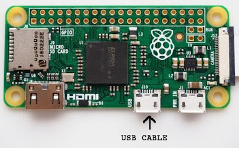
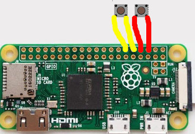
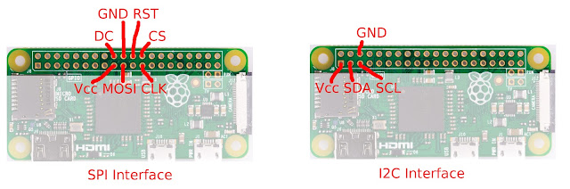

## Step-By-Step instructions:
If you don't have the software called "`etcher`" already installed in your computer, download it here : [https://etcher.io/](https://etcher.io/) . This software is used to write the program image to the SD card.

Download the latest pitrezor SD card image by clicking here and select "save" to save the zip file

Start etcher and follow the instructions. You will need to connect the SD card to your computer to flash the pitrezor image file.

After the card is flashed, put it in the SD card slot in the pi.

Connect the HDMI output to a monitor or tv using the cable and adapter. On the pi 4, use the mini HDMI connector just beside the usb-c connector.

Connect the USB cable in the USB port near the center of the pi, not the one near the corner. Refer to next picture. For the pi 4, the usb-c connector is used.

Connect the other end of the USB cable to your computer or a USB power supply. You should see the pi boot sequence in the monitor and after 4-5 seconds the trezor logo should appear. Good! That confirms that your pi and SD card are working correctly.

At this point you cannot do much, so disconnect the USB cable, HDMI adapter and cable and remove SD card.

If you are using the Adafruit bonnet, it is time to connect it and go straight to the "Configuration" section below. Otherwise, continue reading

Solder the 2 buttons to the pi as showed in the following diagram. The left button (called "no") is connected to the pins 30 and 32 (in yellow in the next picture). The right button (called "yes") is connected to the pins 34 and 36 (in red in the picture). This is the default setup but can be tweaked from configuration file. The pi 4 use the same pins.

Put back the SD card in the pi and reconnect the HDMI and USB cable back to your computer.

It should boot again, otherwise that means something went bad during the soldering of the buttons :(

Open a browser on your computer and navigate to [https://suite.trezor.io/web](https://suite.trezor.io/web)

You can be requested to install the trezor bridge but on chrome it is not absolutly necessary if your system support webusb. Select your operating system to download the correct bridge software if required and perform installation

If you installed the bridge, close and reopen your browser and go back to [https://suite.trezor.io/web/](https://suite.trezor.io/web/)

If you don't plan to use the bridge on Linux, don't forget to set the permission accordingly. Refer to [setting up chrome on linux](https://wiki.trezor.io/User_manual:Setting_up_the_Chrome_extension_on_Linux). 

If the bridge is already installed, you should see a message that invites you to connect your trezor. Connect the USB cable of your pi.

The browser application should detect the device and invite you to perform the trezor setup.

During the setup you will need the buttons to, at least, go from one seed word to another.

If all is working correctly you can disconnect everything to solder the OLED display. The I2C OLED display need 4 wires to solder and the SPI OLED uses 7 wires. Refer to the next picture to determine how to solder the OLED depending on interface. The pins are the same for the pi 4:

Connect the SD card back to your computer and refer to the configuration section below to correctly configure your OLED model and orientation. Their is only 2 possibles orientations so you can try both and see which one is better for you.

Reconnect everything and retry your device. Now you should see the output on the HDMI connector if connected and also on the OLED at the same time.

If that work, put everything in a box!

Enjoy! 

## Configuration
If you connect the SD card in your computer you should see a file named "`pitrezor.config`" in the first partition (boot partition). You can open this file with your favorite text editor. You will be able to change the configuration variables which are:

* `TREZOR_OLED_SCALE` : This control the scale factor of the display to apply when using the HDMI output. A scale factor of 1 means the default size of 128x64 pixel. A scale factor of 2 will stretch the image to 256x128 and so on.

* `TREZOR_OLED_TYPE`: Specify the type of OLED connected to the pi zero. The file enumerate the different value and their meaning. Select the one that match your OLED display.

* `TREZOR_OLED_FLIP`: Set to 0 or 1 to control the image vertically (normal or inverted) This is useful depending how you assemble the OLED in n enclosure.

* `TREZOR_GPIO_YES` and `TREZOR_GPIO_NO` : Specify the GPIO number to use for the yes/no button. If you soldered the buttons like mentionned in the tutorial, you can keep the default values.

When you change a value, keep the line formating as-is with the export statement. Just change the number after the equal sign. If you change something else, this could prevent the pi trezor application to start correctly.

For the Adafruit bonnet, you must change the values to these:

*`export TREZOR_OLED_TYPE=1`
*`export TREZOR_OLED_FLIP=1`
*`export TREZOR_GPIO_YES=6`
*`export TREZOR_GPIO_NO=5`

## Is this secure ?
The main difference of this device versus the real trezor device is that the pi zero stores everything on the SD card. The equivalent of the flash memory for the trezor is stored in a file on the first partition. That means that anybody that has your SD card can access your seed words and private key.

However, the wallet supports the usage of a passphrase. The passphrase is a kind of an extra seed word that is not stored on SD card. By using a passphrase, you would prevent a thief that could have your SD card to empty your wallet.

Thus, the recommendation is to **__always use a passphrase__**!